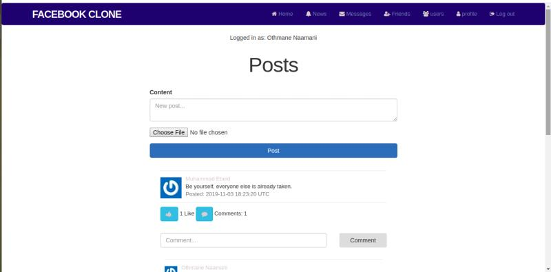

# Project: SOCIAL MEDIA APP 

  A social media project, built to be similar to Facebook.

  The user will create his own account, write posts that will be visible to his friends.

  This project project was built using Ruby on Rails, Ruby Gems, HTML, CSS, SCSS and Bootstrap.

> This project is part of a series of projects to be completed by students of [Microverse](https://www.microverse.org/ 'The Global School for Remote Software Developers!').

# Website

[Project Website](https://tranquil-savannah-73959.herokuapp.com/).

## Test With

- Rspec
- Capybara

## Features:

- This application contains a user authentication.
- User can create his own account.
- User can create account with his facebook.
- User can publish posts and get comments on his posts.
- User can comment his friends posts.
- user can make likes to posts.
- User can send a friendship requests to other users.
- User can accept or decline firendship requests.
- User can Unfriend friends.

## Future Features:

- Add phone, and tablets version.
- User could send messages.
- User will be able to post images and documents.
- Implement a chat and online users features.
- Implement a search system.
- Add groupes and pages systems.

To get a local copy up and running follow these simple example steps.

## prerequisite

1. Git.
2. Code editor.
3. Code linter.
4. Rails.
5. Browser. 

## How to run the program

1. Open the terminal.

2. Enter `git clone https://github.com/othman-19/social_media`.

3. Navigate to the cloned repository.

4. In the terminal cd into social_media.

5. Install bundle by typing `bundle install` and update it by typing `bundle update` in the terminal.

6. Run `rails db:create` then `rails db:migrate` then `rails db:seed` to get a data base with fake data.

7. Run the rails server by typing `rails server` in the terminal.

8. Open [http://localhost:3000](http://localhost:3000) to see in the browser.

9. Sign Up and create some posts and send some friend requests.

## Author(s)

1. [Othmane Naamani](https://github.com/othman-19/).
2. [Molnar Emese](https://github.com/Mesi21).

## Contact

Othmane Naamani:

  - [Github](https://github.com/othman-19/)  
  - [Email:](mailto:othmanenaamani@gmail.com) - othmanenaamani@gmail.com
  - [Portfolio](https://othman-19.github.io/my_portfolio/)  
  - [LinkedIn](https://www.linkedin.com/in/othman-namani/)  
  - [Twitter](https://twitter.com/ONaamani)
  - [DEV Community](https://dev.to/othman) 
  - [AngelList](https://angel.co/othmane-namani) 

Molnar Emese:

  - [Github](https://github.com/Mesi21)  
  - [Email:](mailto:mse212002@gmail.com) - mse212002@gmail.com
  - [Portfolio]()
  - [LinkedIn](https://www.linkedin.com/in/emesemesimolnar/).  
  - [Twitter](https://twitter.com/buksimesi21) 
  - [AngelList]()

## 🤝 Contributing

Contributions, issues and feature requests are welcome!

Feel free to check the [issues page](issues/).

## Show your support

Give a ⭐️ if you like this project!
